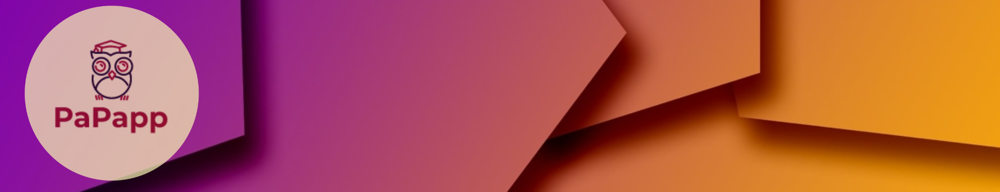

 
<h3 align="center">
 An App made by students for students
</h3>

# Features

- See announcements and news about the University.   
- See today's or this week's menu of the cafeteria.
- Choose the classes you attend and then view the weekly schedule for the lectures.
- Interactive map of the university with directions and info for the buildings.


## Folder Structure
```
.
|--code                         # Android Studio Project Files.
|
|--docs                         # Documentation Files.
|  |--Contributions             # Documentation Contributions Of Each Member.
|  |  |--Ion
|  |  |--Malvina
|  |  |--Stavroula
|  |  |--Vaggelis
|  |  
|  |--final                     # Final Files Submitted On Each Phase.
|  |  |--Phase 1
|  |  |--Phase 2
|  |  |--Phase 3
|  |  |--Phase 4
|  |  |--Phase 5
|  |  |--PaPapp                # Final Product.
|
|-.gitignore                    # .gitignore File.
|-LICENSE                       # The Project's License.
|-README.md --> This File.
```

## Execution Instructions

To see and run the program you need to download the latest Android Studio version (https://developer.android.com/studio), so make sure your system supports it.

- When the installation is completed, download an emulator from the Device Manager (we are using Pixel 3 Api 31).  
- Clone the repository (https://github.com/Ibournakas/PaPapp.git), then go to File -> Open and go to where you cloned the repo.    
- Click on "code" file and when you click "Ok" our project will open on a new window.
- Finally, you can click play to test our app!

## Disclaimer

PaPapp was created as a University Project. As such, it is not a fully functional software product and it's not meant for commercial use.
